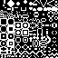

# Balloon Game Movement Demo
- barebones movement demo for dragon/balloon game
- use arrow keys to move

## Gameplay Demo

- physics are controlled by the following variables (`./scripts/player.gd`)
```gdscript
# ./scripts/player.gd
const GRAVITY = 120
const FRICTION = -3
const PLAYER_Y_FORCE = 300
const PLAYER_X_FORCE = 180
```
- the player's Y force must be larger than gravity to get off the ground
- Y force is larger than X force because otherwise horizontal movement is harder to control.
- friction slows the player down while sliding on the ground

## Player Sprite Sheet

- located in `./assets/sprites/spelunky_testing_sprite_fire.png`

## Terrain Tilemap

- random 8x8 tilemap
- located in `./assets/sprites/Microbe.png`
- the size of the terrain map automatically updates based on the viewport width configured in the project settings
```gdscript
# ./scripts/terrain.gd
var tile_size = tile_set.tile_size
var window_width = ProjectSettings.get_setting("display/window/size/viewport_width")
var window_height = ProjectSettings.get_setting("display/window/size/viewport_height")
var configured_size = Vector2(window_width, window_height)
var grid_dimensions = configured_size / Vector2(tile_size)
```
