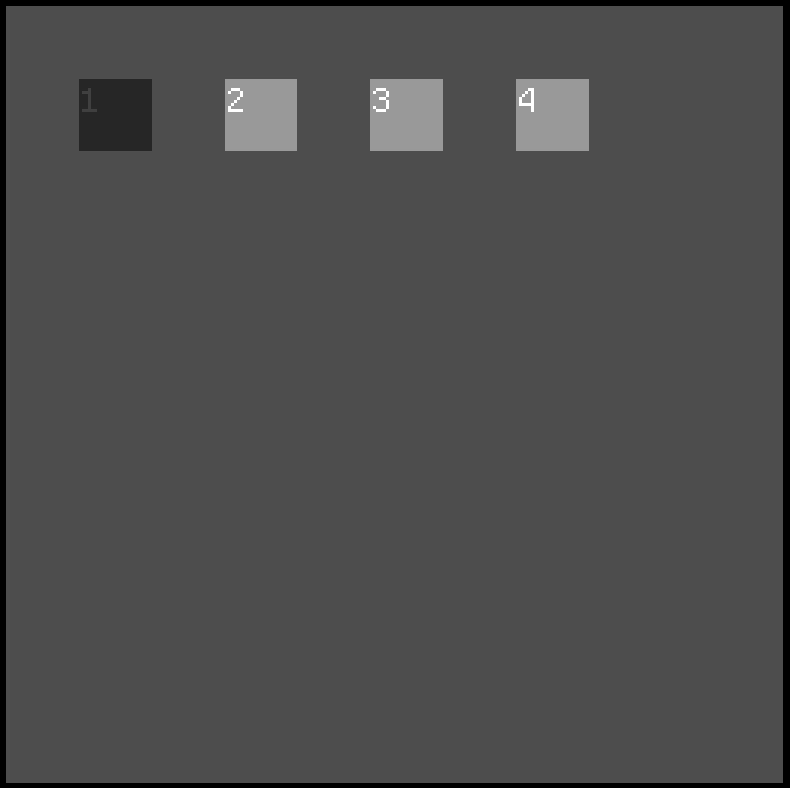
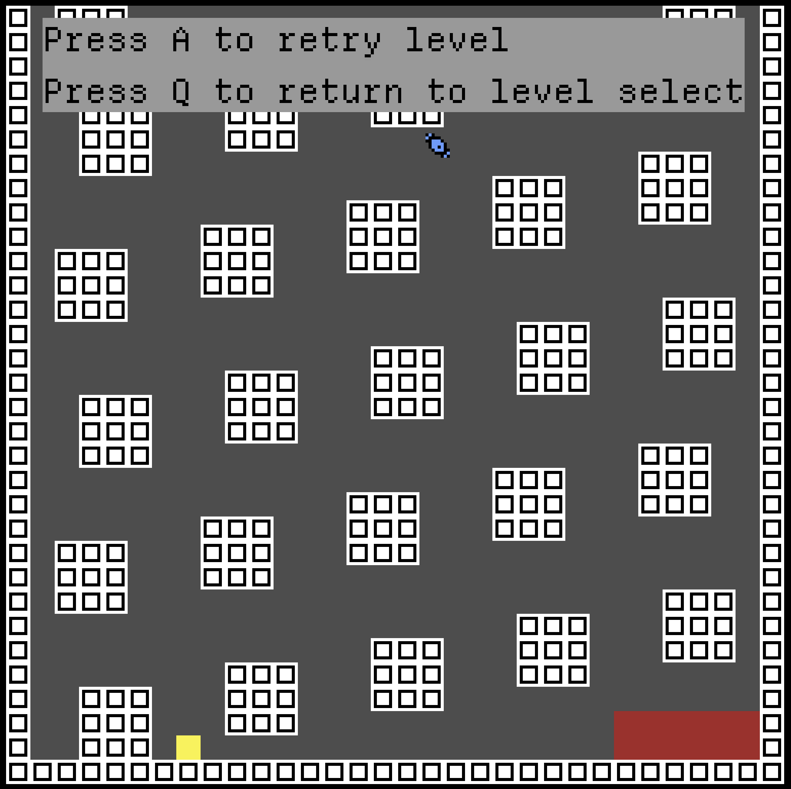

# Balloon Game Movement Demo
- built for godot 4.4
- barebones movement demo for dragon/balloon game
- use arrow keys to move

## Gameplay Demo
  

- physics are controlled by the following variables (`./scripts/player.gd`)
```gdscript
# ./scripts/player.gd
const GRAVITY = 120
const FRICTION = -3
const PLAYER_Y_FORCE = 300
const PLAYER_X_FORCE = 180
```
- the player's Y force must be larger than gravity to get off the ground
- Y force is larger than X force because otherwise horizontal movement is harder to control.
- friction slows the player down while sliding on the ground

## Player Sprite Sheet


- located in `./assets/sprites/spelunky_testing_sprite_fire.png`

## Updates

### Added window scrolling


### Added fuel + power up (fuel replenishment**


### Added level select screen


- auto-populates based on the contents of `./levels`

### Added gameplay loop/post-death options


- if a player navigates to the "end zone" (red square in the bottom right), they beat the level and return to the level select screen
- if a player runs out of fuel, they can press A to replay the level, or Q to return to the level select screej

